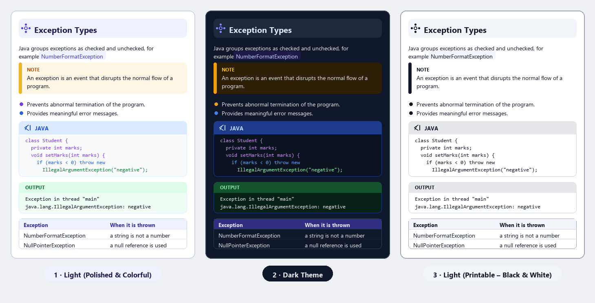
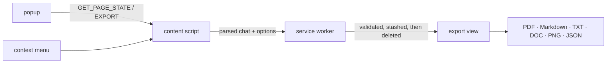

<div align="center">


# AI Exporter

**Turn any AI chat into a document you can keep. Locally.**

ChatGPT · Claude · Gemini · DeepSeek → **PDF · Markdown · TXT · DOC · PNG · JSON**

[](#)
[](#install)
[](#privacy)
[](#verify-it-yourself)
[](#license)


</div>

A Chrome extension (Manifest V3, no build step, no dependencies) that reads the
conversation you are looking at and writes it out as a polished A4 document or a
clean data file. Nothing is uploaded anywhere: the parsing, the rendering and the
downloads all happen inside your browser.

---

## Why it exists

Copy-pasting a chat into a document loses the structure — code blocks arrive as
plain text, tables collapse, headings disappear. Screenshotting it loses the
text. AI Exporter keeps the structure it found on the page and rebuilds it as a
document: **headings, lists, quotes, tables, figures, LaTeX and syntax-coloured
code panels**, in order, with an A4 print layout that actually paginates.

|  |  |
| --- | --- |
| **PDF** | The styled A4 document through the browser's print pipeline: vector text, real page breaks, selectable, no rasterising. |
| **Markdown** | Fenced code, GFM tables and `$tex$` math, generated from the parsed block model. |
| **Text** | Plain reading copy: role headings, bullets, verbatim code. |
| **DOC** | The same styled document wrapped in a Word-compatible HTML header, with the mode's colours, panel fills and table borders baked in as literals — Word's HTML parser has no CSS variables, so leaving them as `var(--ink)` would hand you an unstyled page. |
| **PNG** | A single tall poster rendered on a canvas. |
| **JSON** | The parsed conversation object, verbatim. |

**Three real exports are committed under `assets/`** — one conversation, printed
through all three modes straight from the browser's print pipeline:

| Sample | Mode | What it is |
| --- | --- | --- |
| [`sample-light.pdf`](assets/sample-light.pdf) | 1 · light, colourful | The default look, 42 pages |
| [`sample-dark.pdf`](assets/sample-dark.pdf) | 2 · dark | The same document on navy paper, 38 pages |
| [`sample-print.pdf`](assets/sample-print.pdf) | 3 · printable | Black and grey ink throughout, 42 pages |

Every exported document is the **full transcript** — every prompt and every
answer, in order. A turn can only be left out because you unticked it.

---

## Three document modes



The same document structure, three palettes. Pick one in the export view or in
**Settings → Document theme**; the preview updates immediately, so what you see
is what prints. Each mode has a real export committed under [`assets/`](assets).

| Mode | Look | Use it for |
| --- | --- | --- |
| **1 · Light — polished & colourful**<br>([sample](assets/sample-light.pdf)) | Indigo accents, lavender heading bars and table headers, purple/blue bullets, amber **NOTE**, green **OUTPUT** panel, and a blue code header over colour-highlighted code | Reading on screen, sharing, filing. This is the default. |
| **2 · Dark theme**<br>([sample](assets/sample-dark.pdf)) | Navy paper, indigo accents, the same tinted heading bars, **NOTE** and **OUTPUT** panels, blue code header and colour-highlighted code | Night reading and dark-mode archives. |
| **3 · Light — printable (black & white)**<br>([sample](assets/sample-print.pdf)) | Everything is black or slate on white paper: black heading-bar ink, a grey code header over **black** code, **NOTE** as black on white, grey table header | Printing and photocopying. Every code token collapses to ink, so highlighting costs no toner. |

All three keep the same skeleton, so switching modes changes the palette and
nothing else: **tinted heading bar with a topic icon → NOTE callout → bullets →
code panel → OUTPUT panel → table**. The brand palette (crimson/gold) is reserved
for the cover mark — mode 3 has no colour in it anywhere.

The picture is generated from the exporter's own stylesheet, so it cannot drift
from what you get: `python tools/make-modes-preview.py`.

### Word (DOC) — two modes

The `.doc` export carries its **own switch**, because Word is a different target
from a browser print job:

| Word mode | Look |
| --- | --- |
| **1 · Light & colourful** | The polished palette: indigo heading bars, an amber **NOTE**, a green **OUTPUT** panel, a light code panel with coloured tokens. This is the default. |
| **2 · Clean black & white** | The printable palette: black ink on white paper, grey table headers, every code token demoted to near-black. |

It is deliberately **independent of the PDF theme** — a dark PDF should not hand
you a dark Word file, so the two settings are chosen separately.

Two things make the Word file survive a renderer that is not a browser. Every
`var(--token)` is resolved to a literal before the file is written, because
Word's HTML parser has never heard of custom properties: leave one in and the
whole document lands unstyled, with no panel fills and no table borders. The
palette blocks are then dropped as well, which is what keeps the black-and-white
file genuinely free of colour. The layout also steps down from flexbox, grid and
`::before` to real list markers and block-level bars.

---

## Install

Grab [`dist/ai-exporter-v0.2.0.zip`](dist/ai-exporter-v0.2.0.zip) and unzip it,
or use this checkout directly — either way there is no build step.

1. Open `chrome://extensions` and switch on **Developer mode**.
2. Choose **Load unpacked** and select the unzipped folder (or this folder).
3. Open a supported chat and click the AI Exporter button in the toolbar.

> If the popup says it cannot detect a chat, reload the extension **and** refresh
> the chat tab. A content script only runs in tabs that load after it.

## Use

Four ways in, one export surface out:

| Route | What it does |
| --- | --- |
| **Quick export** | Popup → check the detected conversation → pick a format. The export view opens and the file downloads from there. |
| **Custom selection** | Popup → **Select messages** → tick turns on the page. A floating bar opens the export view for exactly those turns. `Esc` exits. |
| **Right-click** | *Export this AI chat* on any supported page. |
| **Export view** | The preview itself: tick or untick any turn, switch mode and zoom, then save. |

### The export view

- **Messages panel** — every turn starts ticked, with role chips, code/table
  tags and a one-line snippet. `Everything` / `Answers` / `Prompts` / `None` set
  the whole set in one click, and whatever is ticked is what the preview, the
  print job and every download use. Nothing ticked disables the save buttons
  instead of writing an empty file.
- **Three document modes** — pick the look once and the preview, the print job
  and every download follow it (see [Three document modes](#three-document-modes)).
  Mode 1 and 2 are the screen looks; mode 3 is the printable one, where every
  ink colour collapses to black or grey so a mono printer or a photocopier
  reproduces it exactly. Page margins come from `@page`, so *every* printed page
  gets a real margin rather than only the first one.
- **A live page estimate** in the status bar, so you know what you are about to
  print.
- **Printing tip:** in the print dialog, untick **Headers and footers** — that
  is Chrome's own date/title/URL strip in the margins, not part of the document.

## Privacy

- No server, no account, no telemetry, no analytics, no Notion.
- Conversation text is read only after you ask for it, and the export view reads
  the hand-off once and then deletes it from `chrome.storage.session`. Nothing
  else is stored: `chrome.storage.local` holds your export preferences (theme,
  Word mode, timestamps, highlighting) and nothing else.
- The only permissions requested are the ones the flow uses, and the host
  matches are limited to the four supported sites.

## How it fits together



```
manifest.json                 MV3 wiring, permissions, icons, content-script matches
background/service_worker.js  context menu, payload validation, opens the export view
content/content.js            page state, in-page selection mode, export requests
content/content.css           injected checkbox + floating action bar
popup/popup.{html,js,css}     detection, quick export grid, settings
export/export.{html,js,css}   preview tab: message picker, options, downloads, print
utils/parser.js               site-aware DOM extraction into the message schema
utils/exporter.js             markdown, txt, json, doc, html document, png
selftest.html                 73 runnable parser + exporter checks
tools/make-logo.py            generates assets/ and icons/ from one geometry spec
tools/make-modes-preview.py   paints assets/modes.png from the exporter's own palettes
dist/                         the zipped extension, ready to load unpacked after unzipping
```

**One export surface.** The popup, the selection bar and the context menu only
build a chat payload; the service worker validates it, stashes it and opens the
export view. That way no export logic ever runs in a context that can be closed
mid-flight, and the popup never has to survive being dismissed.

**One content model.** `sectionsFor()` turns messages into turns, and the
printed document and the PNG poster both render from it — there is no second
content mode to keep in sync.

## The mark

The mark is a tile and a four-point spark: a conversation read *at a glance*.
Crimson tile, gold spark, both built from one geometry spec, so the SVG in this
repo and the PNGs in `icons/` can never drift apart.

```bash
python tools/make-logo.py          # regenerate assets/ and icons/
python tools/make-logo.py --concepts scratch/   # + the three concept drawings
```

| Token | Hex | Where it lives |
| --- | --- | --- |
| Wine | `#850027` | the mark, the popup's deep tone |
| Crimson | `#a80033` | the mark, the in-page selection controls |
| Gold | `#d9a73f` | the spark, focus rings, the primary action on dark chrome |
| Green | `#38bd5d` | "answered" and success states in the UI |

**The brand palette is confined to the cover mark and the extension chrome.** The
document body is built from each mode's own ramp — indigo for modes 1 and 2, pure
ink for mode 3 — and `selftest.html` fails if a brand hex reaches a document
body, or if any colour at all reaches mode 3.

## Supported sites

- **ChatGPT** — verified against a real logged-in conversation.
- **Claude** — `[data-testid="user-message"]`, `.font-claude-response`.
- **Gemini** — `user-query-content` / `model-response`.
- **DeepSeek** — `.ds-markdown`; user turns use hashed class names, so that part
  is best-effort.

Each site lives behind one small selector adapter in `utils/parser.js`. When a
site ships a redesign, that adapter is the only thing that needs updating.

## Verify it yourself

`selftest.html` runs **77 checks** over the parser and the export engine. Its
fixture is copied from a **live ChatGPT conversation** (September 2026), with the
awkward parts kept: turns are `<section data-testid="conversation-turn-N">`, the
role attribute sits on a descendant, code lives inside an inline CodeMirror
viewer (`<pre>` → `.cm-editor` → `<pre class="cm-content">` → `<code>`), the
language label is a `<div>` *inside* the `<pre>`, and tables are wrapped in
`div.TyagGW_tableContainer`.

Twenty-one of those checks pin the three modes: every mode defines the same
palette slots and tints its code panel header apart from the code body, every
mode draws the topic icon in a tinted heading bar, modes 1 and 2 label the code
panel in the code colour rather than grey, mode 1 keeps its coloured tokens,
mode 3 keeps *nothing* coloured (brand hexes are matched against the mode 3
block, and each code token is checked for saturation), mode 3 prints **NOTE** as
black on white, and code text is measured against its panel for contrast —
17:1, 16.1:1 and 17.7:1 in modes 1, 2 and 3, all past the AAA 7:1 line.

Eight more cover the DOC export, which is the one format that has to survive a
renderer that is not a browser. No `var(--...)` may remain in a `.doc` and its
table borders must be literal hex. The two Word modes are checked separately:
the colour one keeps the light panel and its coloured tokens, the black-and-white
one is scanned for colour across the whole file (saturation, so slate grey is not
mistaken for a colour), a dark PDF theme is proved not to leak into the Word
file, the cover is proved to say *Word* and not *PDF*, and the fallback has to
restore real `list-style: disc` markers because Word has no `::before`.

Open it as an extension page (`chrome-extension://<id>/selftest.html`) or through
any static server:

```bash
python -m http.server 8000     # then visit http://127.0.0.1:8000/selftest.html
```

It prints `PASS n/n` and exposes `window.__selftest` with per-check detail.

## Deliberate limits

- **No vendored libraries.** Manifest V3 forbids remotely hosted code, so
  Turndown, Prism, KaTeX and html2pdf are not used: Markdown is generated from
  the block model, highlighting is a compact tokenizer, math is kept as TeX and
  PDF comes from the browser's own print pipeline.
- **No page numbers and no table of contents in the document.** Page breaks land
  where the content lands, so a printed number would be a guess; use the print
  dialog's own page numbers.
- **Embedded images** are referenced by URL (`data:` or `https:` only). Signed
  page URLs can expire, in which case the export shows a captioned placeholder.
- **The PNG poster** reports images as labelled placeholders.
- **Site DOMs change.** Claude, Gemini and DeepSeek adapters were written from
  documented markup and have not been re-verified against a live logged-in
  session.

## License

No license file yet — that is a decision for the author, and without one the
code is "all rights reserved" by default. MIT or Apache-2.0 are the usual picks
for an extension like this.
